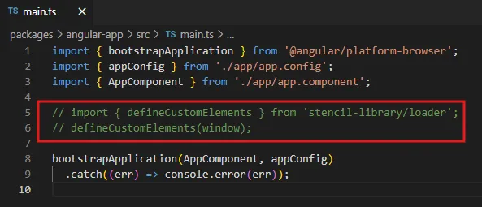
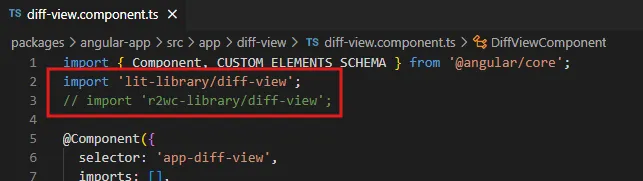
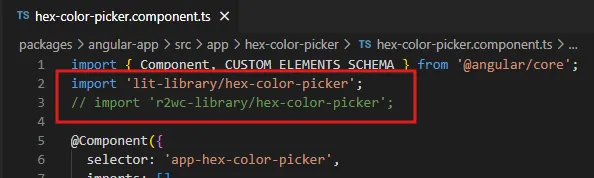

# monorepo-test

## 🎯 Project Goals

- Create a Web Components library that wraps third-party React components and use it in an Angular app.
- Explore and test the following 3 approaches: 
    - [Lit](https://lit.dev/)
    - [`react-to-web-component (R2WC)`](https://github.com/bitovi/react-to-web-component)
    - [Stencil.js](https://stenciljs.com/)

<br>

## 📦 Project Overview

The project is a monorepo ([Yarn workspace](https://yarnpkg.com/features/workspaces)), containing the following packages:


| Package | Description |
|---|---|
| [`angular-app`](packages/angular-app/README.md) | Test Angular application that consumes the Web Component libraries |
| [`lit-library`](packages/lit-library/README.md) | Library built using Lit + Vite |
| [`r2wc-library`](packages/r2wc-library/README.md) | Library built using R2WC + Vite |
| [`stencil-library`](packages/stencil-library/README.md) | Library built using Stencil.js |

<br>

Each implementation of the library exposes two Web Components:
| Web Component | React library | Description |
|---|---|---|
| `<diff-view>` | [@git-diff-view/react](https://github.com/MrWangJustToDo/git-diff-view) | A Diff View component, just like Github |
| `<hex-color-picker>` | [react-colorful](https://github.com/omgovich/react-colorful) | A simple color picker |

<br>

## 🚀 Getting Started

### Prerequisites

- Node.js
- Yarn

### Install

From the repo root:

```bash
yarn install
```

### Build

Build all libraries:

```bash
yarn build:libraries
```

Or build a specific one:

```bash
yarn build:lit-library
yarn build:r2wc-library
yarn build:stencil-library
```
### Import
Comment or uncomment the import lines depending on which library you want to test (the default one is the Lit implementation):







### Start

Run the Angular test app:

```bash
yarn start:angular-app
```

<br>

## 💭 Final Thoughts

**NOTE**: refer to the README of each package for the analysis performed on each library:
- [`lit-library`](packages/lit-library/README.md)
- [`r2wc-library`](packages/r2wc-library/README.md)
- [`stencil-library`](packages/stencil-library/README.md)

<br>

While all three libraries can produce a working solution, in my personal opinion, the ***Lit + Vite*** approach is the best for the following reasons:

- Lit gives full control over the Web Component implementation, unlike R2WC which hides some internal logic.

- Lit’s decorators are simple and intuitive, making it easy to manage properties, attributes, and events.

- Lit has a very small runtime (~5 KB minified and compressed).

- Vite makes it easy to define multiple entry points, allowing to export individual Web Components separately. This way, only the needed components are imported, rather than the entire library.

- Vite also generates shared chunks automatically (e.g., React runtime is placed in a separate chunk), improving performance.

- The Vite build process is highly customizable - for example, when using the diff-view React component, you can easily exclude unnecessary syntax highlight languages, significantly reducing the final bundle size.
