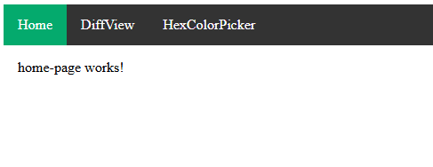
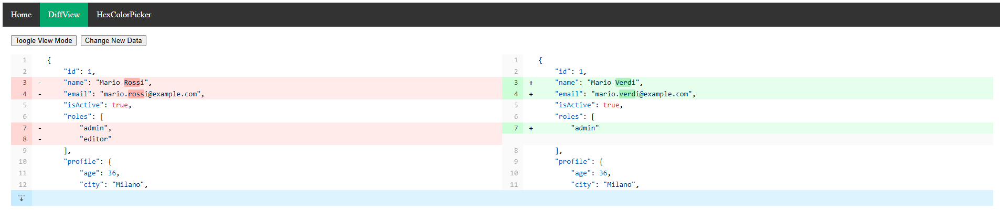
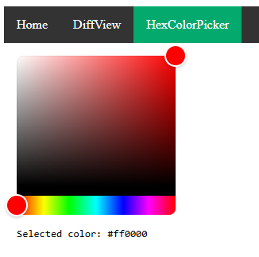

# angular-app

## Overview
- The Angular app is used to test the different implementations of the Web Components libraries.
- It is a minimal Angular app with 3 lazy loading routes:
    - Home (empty page)

        

    - Diff View

        

    - Hex Color Picker

        

<br>

## Custom Elements Schema
- In order to use the Web Components correctly in Angular, it is necessary to add the following schema to the Angular component where the Web Component is used: 
```javascript
schemas: [CUSTOM_ELEMENTS_SCHEMA]
```

- Then the Web Component can be used normally as any other tag.

<br>

## Understanding Property Binding Between Angular and Web Components
It's important to understand that even when using Angular-style binding for properties, it doesn't behave exactly like with native Angular components — because Web Components are not Angular components. For instance, when you bind a value to a Web Component, Angular sets an *attribute* on the element, not a *property* on the underlying class instance. This subtle difference can affect how data flows.

In particular, property binding between Angular and a Web Component is **one-way**: from Angular *into* the Web Component.

For example, imagine you have an Angular component with a `color: string` field, and you bind it to a custom Web Component’s `color` attribute. Angular will pass the value correctly. However, if the Web Component internally updates its `color` property (e.g., the user changes it via UI), Angular won’t be notified — the change won’t propagate back to the Angular component.

To partially address this, frameworks like Lit or Stencil.js allow you to use the `reflect` option on a property. This ensures that changes to the internal property are reflected as attributes in the DOM. However, this *still* doesn’t update Angular’s model — because Angular doesn’t observe changes to DOM attributes on custom elements.

If two-way binding is needed, you must **manually handle it** using custom events. The Web Component should emit a custom event (e.g., `colorChanged`) when the property changes, and Angular should listen to that event and update its internal state accordingly.

This is exactly what is done in the test app for the hex-color-picker component ([`src/app/hex-color-picker/hex-color-picker.component.ts`](src/app/hex-color-picker/hex-color-picker.component.ts)).
