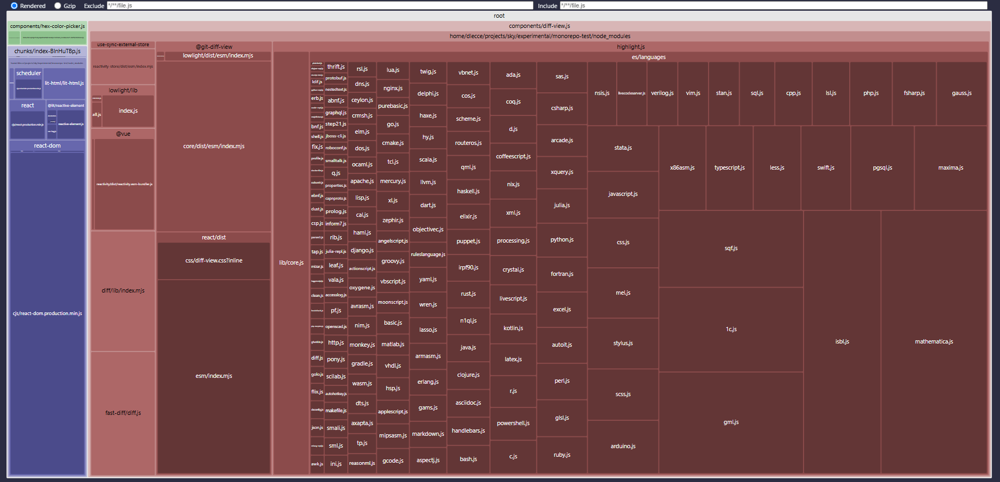

# lit-library
This library defines each Web Component using [Lit](https://lit.dev/), leveraging its declarative API to wrap third-party React components. React is rendered into the Web Component's DOM using `ReactDOM.createRoot()`.

## Core Lit Concepts
| Feature | Lit API | Purpose |
|---|---|---|
| Define component | `@customElement('tag-name')` | Registers the custom element |
| Reactive property | `@property()` | Declares reactive inputs that trigger updates |
| DOM lifecycle | `firstUpdated()`, `updated()`, `disconnectedCallback()` | Hooks for mounting/unmounting logic |
| Shadow DOM control | `createRenderRoot()` | Enables/disables Shadow DOM |


## Mounting React with Lit Lifecycle Hooks
React components are mounted inside Lit-based Web Components by taking advantage of **Lit’s lifecycle hooks**.

### 1: `firstUpdated()`: Initial React mounting
```typescript
firstUpdated() {
  this.reactRoot = ReactDOM.createRoot(this.renderRoot);
  this.renderReactComponent();
}
```
- This method is called by Lit **once the component has been rendered to the DOM for the first time**.
- It’s the perfect place to **initialize and mount the React component**.
- `ReactDOM.createRoot(this.renderRoot)` creates a React root pointing to the DOM rendered by Lit (either Shadow DOM or Light DOM).
- Then, `this.renderReactComponent()` renders the actual React tree.

### 2. `updated()`: React re-render on property change
```typescript
updated() {
  this.renderReactComponent();
}
```
- `updated()` is called **after Lit updates the DOM in response to property changes**.
- Here, it is used to **re-render the React component** with updated props, keeping the React view in sync with Lit's reactive properties.
- For example, if `color` or `oldData`/`newData` changes, React will be updated accordingly.

### 3. `disconnectedCallback()`: Cleanup
```typescript
disconnectedCallback() {
  if (this.reactRoot) {
    this.reactRoot.unmount();
  }
}
```
- This method is called when the custom element is removed from the DOM.
- It ensures the associated React component is **cleanly unmounted**, avoiding memory leaks.

## Disabling Shadow DOM
By default, Lit components render their DOM inside a **Shadow DOM root**, which encapsulates styles and structure from the rest of the page. This is useful for isolating Web Components, but it can create issues when integrating with third-party libraries, especially those that rely on global CSS injection.

### The Problem
The React library used in the `<hex-color-picker>` component ([react-colorful](https://github.com/omgovich/react-colorful)) injects its CSS styles **directly into the global document** `<head>`. These styles are **not scoped** to the Shadow DOM.

As a result:
- If the Lit component renders into Shadow DOM (default behavior), the styles from react-colorful **won’t apply**, and the color picker appears **unstyled or broken**.
- The solution is to render into the **light DOM** (the normal DOM), so that the CSS defined globally is visible to the React-rendered component.

```typescript
  protected createRenderRoot() {
    return this; // renders in the light DOM instead of shadow root
  }
```

## Development & Entry Points
The library is built using Vite, leveraging its multi-entry support to export each component independently.

### `package.json` exports
```json
"exports": {
  "./diff-view": "./dist/components/diff-view.js",
  "./hex-color-picker": "./dist/components/hex-color-picker.js"
}
```

This allows consumers to import only the needed component:

```typescript
import 'lit-library/diff-view';
```

### Available scripts
```bash
yarn dev     # Start Vite dev server
yarn build   # Build the library into ./dist
```

## Bundle Analysis
The Vite build automatically creates optimized shared chunks. For example, the React runtime is placed in a separate chunk, avoiding duplication when wrapping multiple React components.

### Bundle inspection
To analyze the output size, the project uses `rollup-plugin-visualizer`:
```typescript
import { visualizer } from 'rollup-plugin-visualizer';

visualizer({
  filename: 'bundle-stats.html',
  gzipSize: true
});
```
This generates an interactive HTML report (`bundle-stats.html` in the root of the library) that highlights heavy modules and dependencies.

### Optimization: Reducing highlight.js bundle size
While analyzing the bundle, it became clear that the `@git-diff-view/react` library introduces a significant size overhead due to syntax highlighting.

Specifically:

- `@git-diff-view/react` internally uses [highlight.js](https://highlightjs.org/) via the `lowlight` library
- Unfortunately, it **loads all available languages by default**
- It does **not provide a configuration API** to limit or customize which languages are included

This drastically increases the final bundle size, as showed in the bundle-stats.html:


1. hex-color-picker Web Component (it includes the `react-colorful` library)
2. chunk that includes common parts (React and React DOM runtime, Lit runtime, ...)
3. diff-view Web Component (it includes the `@git-diff-view/react` library)

<br>



### Solution: Customizing `lowlight` via Vite alias
To work around this, a custom instance of `lowlight` was created, registering **only the `json` language**, which is the only one required in this use case:

**src/utils/lowlight/index.ts**
```typescript
const lowlight = createLowlight({ json });
```

Then, in `vite.config.ts`, an **alias** is used to override the internal import:
```typescript
resolve: {
  alias: {
    '@git-diff-view/lowlight': resolve(__dirname, 'src/utils/lowlight/index.ts')
  }
}
```

This technique leads to a substantial improvement in the final bundle size, without changing the source code of `@git-diff-view/react`:


1. hex-color-picker Web Component (it includes the `react-colorful` library)
2. chunk that includes common parts (React and React DOM runtime, Lit runtime, ...)
3. diff-view Web Component (it includes the `@git-diff-view/react` library)

<br>


### Results: Size reduction
Thanks to this customization, the bundle size was reduced by **over 80%**, with no change to the source code of the third-party library.

| | Size |
|---|---|
| Before | **1,129.96 kB** |
| After | **198.03 kB** |