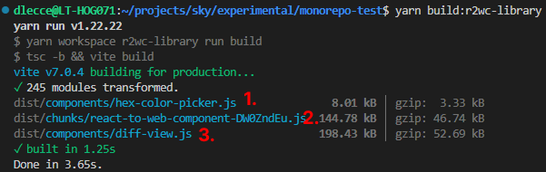

# r2wc-library
This library wraps React components as Web Components using the [@r2wc/react-to-web-component](https://github.com/bitovi/react-to-web-component) library.

## Core R2WC Concepts
| Feature | R2WC API | Purpose |
|--------|------------|---------|
| Create Web Component | `r2wc(ReactComponent, options)` | Converts a React component into a custom element |
| Props definition | `props: { key: type }` | Defines which props can be passed and how they’re parsed |
| Event dispatching | Custom events | Allows communication from the Web Component to the outside |
| Shadow DOM | `shadow: 'open' \| false` | Enables or disables Shadow DOM encapsulation |

## Components

Unlike Lit.js, `r2wc` does not expose lifecycle hooks such as `firstUpdated()` or `disconnectedCallback()`. So we don't need to manually mount or update the React component: `r2wc` handles all of that internally.

All we have to do is define which props should be passed to the React component, and `r2wc` will bind them automatically. This simplicity is one of `r2wc`'s strengths, but it also comes with trade-offs.

### ✅ Advantage:
- **No boilerplate**: just wrap your React component and define the prop types.

### ⚠️ Disadvantage:
- **No visibility** into the mounting/rendering lifecycle. You don’t control when and how props are applied or how rendering is triggered.
- **Debugging can be harder**: if something goes wrong, it's difficult to trace the problem since the React mounting is hidden behind the abstraction.

---

### Example: `<hex-color-picker>`

This component wraps the `react-colorful` color picker and defines two props:

```ts
const HexColorPickerWebComponent = r2wc(HexColorPicker, {
  props: {
    color: 'string',
    onChange: 'function'
  }
});
customElements.define('hex-color-picker', HexColorPickerWebComponent);
```

### How props work in `r2wc`

All props passed to the Web Component **must be provided as strings**, because HTML attributes are string-based. `r2wc` will automatically convert them to the correct type based on the type you specify (`string`, `number`, `boolean`, `json`, or `function`).

This works fine for primitives and JSON, but introduces subtle issues with **functions**.

### HTML usage

```html
<hex-color-picker color="#00ff00" on-change="onColorChange"></hex-color-picker>

<script>
  function onColorChange(color) {
    console.log('color changed!', color);
  }
</script>
```

In the example above, the `onChange` function is passed as a **string reference** (`"onColorChange"`), and `r2wc` will look up a global function named `onColorChange` on `window`. This is non-standard behavior and can be unintuitive.

### Problem in frameworks (e.g., Angular)

This design **breaks integration with Angular**, where you typically bind event handlers using `(event)="handler($event)"`. Since `r2wc` expects a string with the global function name, the Angular binding won't work and the function will never be called.

In Angular, we might do something like:

```html
<hex-color-picker [color]="value" (onChange)="handleColorChange($event)"/>
```

But this **does not work**, because:
- `r2wc` does not use DOM events for function props.
- The handler must be accessible as a global function **by name**.

## Disabling Shadow DOM

Just like in the `lit-library`, the `<hex-color-picker>` component uses [`react-colorful`](https://github.com/omgovich/react-colorful), which injects styles into the global document. These styles are not visible inside Shadow DOM.

To avoid styling issues, we can render the component in the **Light DOM** by disabling Shadow DOM in the `r2wc` configuration.

```ts
const HexColorPickerWebComponent = r2wc(HexColorPicker, {
  props: { color: 'string' },
  shadow: false // disables Shadow DOM
});
```

## Development & Entry Points

This library shares the same development setup and Vite-based build process as the [`lit-library`](../lit-library/README.md#development--entry-points), including:

- Multi-entry component exports via `package.json`
- Per-component imports like:
  ```ts
  import 'r2wc-library/diff-view';
  ```

Refer to the lit-library [README](../lit-library/README.md) for full details.

## Bundle Analysis

The bundle analysis setup and findings (e.g. use of `rollup-plugin-visualizer`, chunk splitting, and the `highlight.js` size issue with `@git-diff-view/react`) are the same as in the [`lit-library`](../lit-library/README.md#bundle-analysis).

Refer to that section for the full explanation and optimization techniques.

🔍 The final bundle size may differ slightly from the `lit-library` due to differences in how components are wrapped, but overall the result is very similar.



1. `<hex-color-picker>` Web Component (it includes the `react-colorful` library)
2. chunk that includes common parts (React and React DOM runtime, R2WC runtime, ...)
3. `<diff-view>` Web Component (it includes the `@git-diff-view/react` library)