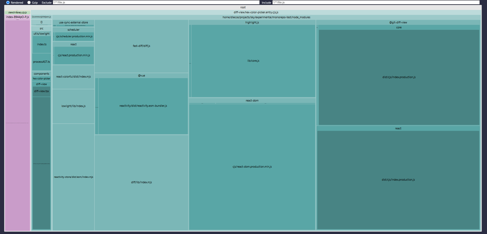

# stencil-library
This is the library built with [Stencil.js](https://stenciljs.com/), wrapping third-party React components.

## Core Stencil.js Concepts

Stencil uses TypeScript decorators to define Web Components in a way that feels very similar to Angular. Components are annotated with `@Component`, reactive properties with `@Prop`, events with `@Event`, and the DOM is accessed using `@Element`.

The compiler generates framework-agnostic Web Components that can be used across any modern frontend stack.

## Mounting React with Stencil.js Lifecycle Hooks

React components are mounted inside Stencil using the lifecycle hooks `componentDidLoad` and `componentDidUpdate`. Mounting is done manually using `ReactDOM.createRoot(...)` and `render(...)`.

This approach is very similar to Angular’s structure, where decorators define reactive inputs and the component lifecycle is used to control the behavior.

Extract from `diff-view.tsx`:

```tsx
@Component({ 
  tag: 'diff-view', 
  shadow: true 
})
export class DiffView {
  @Element() el: HTMLElement;
  @Prop() oldData: any;
  @Prop() newData: any;

  componentDidLoad() {
    this.reactRoot = ReactDOM.createRoot(this.el.shadowRoot);
    this.renderReactComponent();
  }

  componentDidUpdate() {
    this.renderReactComponent();
  }

  ...

}
```

## Disabling Shadow DOM
Just like in the `lit-library`, the `<hex-color-picker>` component uses [`react-colorful`](https://github.com/omgovich/react-colorful), which injects styles into the global document. These styles are not visible inside Shadow DOM.

To avoid styling issues, we can render the component in the **Light DOM** by disabling Shadow DOM in the `@Component` section of the Stencil Web Component.

```tsx
@Component({
  tag: 'hex-color-picker',
  styleUrl: 'hex-color-picker.css',
  shadow: false // disables Shadow DOM
})
...
```

## Development & Entry Points

Stencil compiles each component into a native Web Component and provides a lazy loader.
The lazy loader can be imported in the Angular app like this:

[`main.ts`](../angular-app/src/main.ts)
```ts
import { defineCustomElements } from 'stencil-library/loader';
defineCustomElements();
```

⚠️ However these are the results that came up from experimentation:
- The lazy loader only helps to define custom elements dynamically, so that you don't need to manually define a new `export` everytime you add a new Web Component.
- **The entire library is still loaded all at once**.
- **React and other shared dependencies are NOT split into separate chunks**.

So even though Stencil provides a "lazy loader", the whole library is downloaded immediately (only once a Web Component is actually used in the current page), which makes the lazy loading not effective.

## Bundle Analysis
The `highlight.js` size issue with `@git-diff-view/react` is the same as in the [`lit-library`](../lit-library/README.md#bundle-analysis), so refer to that section for the full explanation and optimization techniques.

Bundle size and structure were analyzed using `rollup-plugin-visualizer`:



Key findings:
- React, ReactDOM, and the other React third-party libraries are bundled in the same output file.
- Stencil does not extract React runtime into a shared chunk.
- The lazy loader does not achieve meaningful performance in this setup.


---

📦 **Final bundle size**: slightly larger than `lit-library` and `r2wc-library` because Web Components and dependencies (React) are bundled together in the same file (~380 kB).
